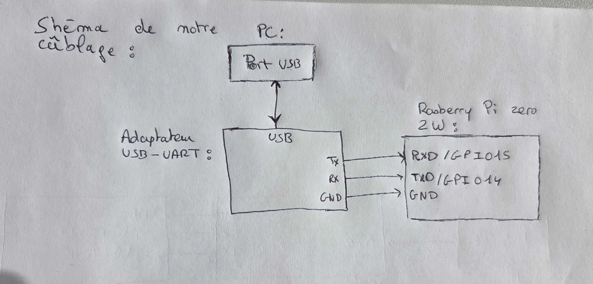
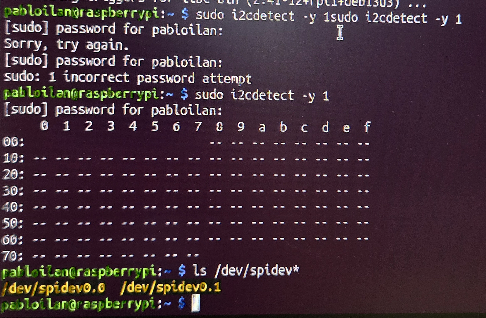

# TP-programmation-embarquee

Réflexion :
Notre nom d’hôte est « C106-IH-Pc » et notre nom d’utilisateur est « pabloilan ». Il est important de noter ces informations, car elles sont nécessaires lors du lancement du Raspberry Pi. En effet, la connexion au système d’exploitation du Raspberry Pi exige une authentification à l’aide d’un identifiant et d’un mot de passe.

1) TX est la broche qui permet de transmettre les données et RX permet de les recevoir. Les relier ainsi permet le bon échange des données dans les deux sens.

2) Le GND permet d’avoir une masse commune entre la Raspberry et l’adaptateur. Sans le GND, la communication n’est pas possible.

3) 115 200 représente la vitesse de transmission en bauds. 8 bits pour la taille de la donnée, N pour l’absence de parité (No parity) et 1 pour le nombre de bits d’arrêt.

4) La Raspberry Pi fonctionne à 3,3 V, elle ne tolère donc pas une tension de 5 V. Cela pourrait griller la carte.

5) Si la vitesse est différente, les bits sont lus au mauvais rythme et ne peuvent pas être décodés correctement. La communication échoue et le terminal affiche des caractères incompréhensibles.

6)

Réflexion : La connexion UART utilise un adaptateur USB-Série branché directement sur les broches de la carte, avec le port série activé et un terminal réglé sur la bonne vitesse. Son grand avantage est de fonctionner sans réseau dès le démarrage, mais sa limite reste la nécessité d'un câble et d'une proximité physique.

La connexion SSH passe par le réseau via Wi-Fi ou Ethernet, et demande simplement que le service SSH soit activé et que l'adresse IP soit connue. Elle permet de tout contrôler à distance, mais devient inutilisable si le réseau échoue ou si le système ne démarre pas.  

Réflexion : 

- L'adresse IP obtenue : 10.10.3.227
- Oui nous avons bien pu nous connecté a internet. 
- Sur le PC de la salle, n'étant pas administrateurs, nous ne possédons pas les droits "sudo" (les privilèges suprêmes). En revanche, comme nous avons flashé la carte SD avec un système d'exploitation dont nous sommes les seuls administrateurs, nous connaissons le mot de passe. Nous pouvons donc y exécuter la commande "sudo" grâce au mot de passe configuré lors du flashage.

Réflexion (Sécuriser SSH avec une clé) : 

1) La clé privée se trouve sur notre PC et la clé publique est installée sur la Raspberry Pi.
2) La clé privée doit rester sur le PC car elle sert à prouver son identité.
3) Le fichier authorized_keys contient la liste des clés publiques qui sont autorisées à se connecter à la Raspberry Pi sans mot de passe.
4) Le mot de passe protège le compte utilisateur sur la Raspberry Pi, tandis que la phrase secrète sert à chiffrer et déverrouiller la clé privée directement sur le PC.
5) Il faut tester la connexion dans un deuxième terminal pour vérifier que la clé SSH marche bien. Si on s'est trompé dans la clé et qu'on a déjà coupé les mots de passe, on se retrouve bloqué dehors. En gardant le premier terminal ouvert avec nos identifiants, on a toujours une sécurité pour corriger l'erreur si besoin.
6) Il faut mettre ces droits pour que personne d'autre ne puisse lire ou modifier nos clés. Le dossier .ssh en 700 et le fichier authorized_keys en 600 garantissent que seul le propriétaire a l'accès. Si les droits sont trop ouverts, SSH refuse la connexion par sécurité.

Question de réflexion TP2 : 

1) Un moteur ne doit pas être branché directement sur une broche GPIO car elle ne fournit pas un courant suffisant. Le moteur demande une intensité qui grillerait la Raspberry Pi. C'est pour cela que l'on utilise un driver.
2) En I2C et en SPI, le principe de sélection n'est pas le même. En I2C, le composant est sélectionné par son adresse numérique, alors qu'en SPI il y a un fil dédié à chaque composant et il utilise une ligne physique qui lui est dédiée.
3) Les deux appareils doivent utiliser la même vitesse pour que les bits soient bien interprétés, comme il n'y a pas de signal d'horloge.
4) Les programmes de TP doivent toujours fermer ou nettoyer les interfaces matérielles pour éviter qu'un composant reste activé par erreur.
5) Le driver va nous permettre de faire le pont entre la partie logicielle et le matériel de la Raspberry Pi. Et le fait de séparer main.py, config.py et le driver va permettre de rendre le programme plus clair et plus facile à modifier.

